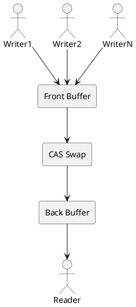

# Lock-Free Double Buffer Architecture

## Overview

This project implements a **lock-free double buffer** system designed for high-efficiency traffic processing on Linux Intel x86_64 systems. The architecture enables multiple writer threads to produce data concurrently while a single reader thread consumes and persists data to disk, all without traditional mutex-based synchronization.

The lock-free design minimizes latency and maximizes throughput by eliminating contention between producers and consumers through atomic operations and careful memory ordering.

## Architecture Diagram




## Components

### 1. Front Buffer

The **Front Buffer** is the active buffer where writer threads write their data.

**Characteristics:**
- Multiple writers can write concurrently using lock-free atomic operations
- Writers use C11 atomics (`_Atomic`) for coordination without mutexes
- Buffer entries are written using compare-and-swap (CAS) operations
- Writers never block each other or the reader
- When full or swapped, becomes the back buffer for reading

**Implementation Details:**
- Fixed-size circular buffer (configurable via `BUFFER_CAPACITY`)
- Each entry holds variable-sized data blocks (10 to 10,000 bytes)
- Atomic index management for lock-free insertion
- Memory ordering ensures visibility across cores

### 2. Back Buffer

The **Back Buffer** is where the reader thread safely reads completed data.

**Characteristics:**
- Single reader has exclusive access during read phase
- Contains a consistent, complete snapshot of produced data
- Reader processes entries sequentially
- No concurrent writes during read phase (guaranteed by swap mechanism)
- After processing, becomes available as the new front buffer

**Implementation Details:**
- Same structure as front buffer (mirrored design)
- Reader iterates through all valid entries
- Data is persisted to disk via write syscalls
- Statistics are collected during processing

### 3. CAS Swap (Compare-And-Swap)

The **CAS Swap** is the atomic operation that exchanges the front and back buffers.

**Characteristics:**
- Lock-free synchronization primitive
- Atomic pointer exchange ensures consistency
- Writers automatically redirect to new front buffer after swap
- No data races or torn reads possible
- Minimal overhead (single atomic instruction)

**Implementation Details:**
- Uses C11 `atomic_compare_exchange` operations
- Memory ordering: `memory_order_acq_rel` for synchronization
- Swap triggered when front buffer reaches capacity or reader is ready
- Pointer-based indirection allows zero-copy buffer switching

### 4. Writers (N Threads)

**Writers** are producer threads that generate and write data to the front buffer.

**Characteristics:**
- Multiple concurrent writers (configurable via `WRITER_COUNT`)
- Each writer runs on an isolated CPU core (core affinity)
- No syscalls in hot path (minimal latency)
- Lock-free coordination using atomic operations only
- Perform auxiliary work between writes to simulate realistic workloads

**Work Pattern:**
1. Generate random data block (size: 10 to 10,000 bytes)
2. Atomically write block to front buffer
3. Perform auxiliary work (computation, simulation)
4. Repeat until process completion

**Implementation Details:**
- Thread creation via POSIX threads (`pthread`)
- CPU affinity set using `pthread_setaffinity_np()`
- Random block generation for realistic traffic simulation
- Atomic index increment for lock-free slot allocation

### 5. Reader (1 Thread)

The **Reader** is the single consumer thread that reads data from the back buffer and persists it to disk.

**Characteristics:**
- Single reader thread (no read contention)
- Exclusive access to back buffer during processing
- Responsible for data persistence and statistics collection
- Performs auxiliary work between operations
- Outputs final statistics at process completion

**Work Pattern:**
1. Wait for back buffer to have data (polling or signaling)
2. Process all entries in back buffer sequentially
3. Write each block to disk (output file)
4. Update statistics (block count, total bytes, size distribution)
5. Perform auxiliary work
6. Trigger buffer swap when ready
7. Repeat until shutdown signal

**Implementation Details:**
- File I/O via standard C file operations or POSIX syscalls
- Statistics tracking using local counters
- Graceful shutdown via atomic flag
- Final report generation at completion

## Design Principles

This architecture follows key design principles outlined in [SESSION_SUMMARY.md](../SESSION_SUMMARY.md):

### 1. Multiple Writers, Single Reader

- **N writer threads** produce data concurrently on isolated cores
- **1 reader thread** serializes disk I/O and statistics collection
- Eliminates read-side contention and simplifies coordination

### 2. No Mutexes - Lock-Free Synchronization Only

- All coordination uses C11 atomic operations
- Compare-and-swap (CAS) for buffer management
- Atomic counters for index management
- Memory ordering guarantees for cross-core visibility
- Zero blocking operations in writer hot path

### 3. Producer-Consumer Pattern

- **Producers (writers)** write to front buffer continuously
- **Consumer (reader)** reads from back buffer when ready
- **Atomic swap** exchanges buffers without copying data
- Double buffering decouples production and consumption rates

### 4. Core Isolation

- Writers pinned to separate CPU cores via affinity
- Minimizes cache coherency traffic
- Reduces contention for shared resources
- Maximizes parallel execution

### 5. Minimal Latency Operations

- Writers avoid syscalls in critical path
- Lock-free operations complete in bounded time
- No blocking or waiting on locks
- Predictable performance characteristics

## Use Case

This architecture is designed for **high-efficiency network and application traffic processing with monitoring and security**:

### Primary Application Scenarios

1. **High-Performance Network Traffic Capture**
   - Capture packets from network interfaces at line rate
   - Multiple capture threads process different flows or interfaces
   - Single persistence thread writes to disk for analysis

2. **Application Event Logging**
   - Multiple application threads generate log events
   - No blocking on log writes (critical for low-latency systems)
   - Background thread flushes logs to disk asynchronously

3. **Security and Audit Trails**
   - Continuous monitoring of system or application activity
   - Security-critical events written to persistent storage
   - Non-blocking design prevents monitoring from impacting performance

4. **Real-Time Analytics Pipeline**
   - Multiple data sources produce events concurrently
   - Consumer aggregates and persists for downstream processing
   - Statistics collection for monitoring and alerting

### Key Benefits

- **Minimal Performance Impact**: Lock-free design ensures producers never block
- **Data Integrity**: Atomic operations guarantee no data loss or corruption
- **Scalability**: Supports multiple concurrent writers on modern multi-core systems
- **Observability**: Built-in statistics collection for monitoring
- **Reliability**: Single writer to disk simplifies error handling and recovery

## Configuration

The system is highly configurable via compile-time constants defined in `include/config.h`:

| Parameter | Default | Description |
|-----------|---------|-------------|
| `BUFFER_CAPACITY` | 1024 | Number of entries per buffer |
| `WRITER_COUNT` | 4 | Number of concurrent writer threads |
| `OUTPUT_FILE_PATH` | "output.log" | Path for output file |
| `DEBUG_MODE` | 0 | Enable debug output (0 or 1) |
| `ENABLE_STATS` | 1 | Enable statistics collection (0 or 1) |

Override at compile time:
```bash
make CFLAGS="-std=c11 -O3 -march=native -DBUFFER_CAPACITY=2048 -DWRITER_COUNT=8"
```

## Performance Considerations

### Memory Ordering

The implementation uses appropriate C11 memory ordering semantics:
- `memory_order_relaxed`: For non-synchronizing operations
- `memory_order_acquire`/`memory_order_release`: For synchronization points
- `memory_order_acq_rel`: For read-modify-write operations (CAS)
- `memory_order_seq_cst`: When strict ordering is required

### Cache Coherency

- Writers on separate cores minimize false sharing
- Buffer structures aligned to cache line boundaries
- Atomic operations use CPU cache coherency protocols (MESI)
- Memory ordering ensures visibility across cores

### Scalability

- Performance scales with number of writer threads up to core count
- Single reader prevents write-side contention to output file
- Buffer capacity should be tuned based on:
  - Writer production rate
  - Reader consumption rate
  - Acceptable latency for data persistence

## Implementation Status

This architecture documentation describes the intended design. Implementation is in progress following the development phases outlined in [SESSION_SUMMARY.md](../SESSION_SUMMARY.md):

- **Phase 1**: Core Structure (lock-free double buffer implementation)
- **Phase 2**: APIs (writer, reader, statistics, configuration)
- **Phase 3**: Demo Integration (thread management and coordination)
- **Phase 4**: Statistics and Validation (performance metrics and verification)

## References

- [SESSION_SUMMARY.md](../SESSION_SUMMARY.md) - Detailed planning and requirements
- [README.md](../README.md) - Project overview and build instructions
- [C11 Standard](https://en.cppreference.com/w/c/atomic) - Atomic operations reference
- [Intel x86_64 Architecture](https://www.intel.com/content/www/us/en/developer/articles/technical/intel-sdm.html) - Memory ordering model

## Learning Resources

This project serves as an educational implementation for understanding:

1. **Lock-Free Programming**: Atomic operations, memory ordering, ABA problem
2. **High-Performance Systems**: Core affinity, cache optimization, latency minimization
3. **Concurrent Patterns**: Producer-consumer, double buffering, work distribution
4. **C Systems Programming**: Low-level memory management, threading, I/O optimization

For additional context and decision rationale, see [CHAT_LOG.md](../CHAT_LOG.md).
