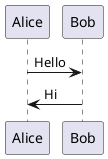

# Glossary

## Terms and Definitions

### Tool
A named endpoint that agents can discover and call.

**Example:** `encodePlantUML` is a tool that encodes PlantUML diagrams into URLs.

---

### Tool Discovery
The process by which agents learn about available tools and their capabilities.

**Endpoint:** `GET /api/tools`
**Purpose:** Returns a list of tools with their schemas, descriptions, and required parameters.

**Why important:** Agents need to discover tools dynamically without hardcoding endpoints.

---

### Tool Invocation
The act of calling a tool with specific parameters.

**Endpoint:** `POST /api/tools/{toolName}`
**Purpose:** Executes the tool's logic and returns a result or error.

**Example:**
```bash
POST /api/tools/encodePlantUML
{
  "plantumlCode": "@startuml\nA --> B\n@enduml"
}
```

---

### MCP (Model Context Protocol)
A protocol developed by Anthropic for AI agents to use external tools and resources.

**Key features:**
- Tool discovery
- Tool invocation
- Resource management
- Standardized schemas

**Our implementation:** HTTP-based (not JSON-RPC 2.0), but MCP-compatible in semantics.

---

### PlantUML
A diagram-as-code tool that generates diagrams from text descriptions.

**Supported diagram types:**
- Sequence diagrams
- Use case diagrams
- Class diagrams
- Activity diagrams
- Component diagrams
- State diagrams
- Object diagrams
- Deployment diagrams
- Timing diagrams

**Example:**


---

### Encoding
The process of converting PlantUML code into a URL-safe format for sharing.

**Steps:**
1. Compress code using `zlib.deflateRaw`
2. Encode as Base64
3. Map Base64 characters to PlantUML alphabet
4. Construct URL: `https://www.plantuml.com/plantuml/svg/{encoded}`

---

### Deterministic
A property where the same input always produces the same output.

**Why important:**
- Enables caching
- Reproducible URLs
- Predictable behavior

**Example:** Same PlantUML code → Same encoded URL every time.

---

### Stateless
A system that does not store any data between requests.

**Advantages:**
- Simple to implement
- Scales horizontally
- No data management overhead

**Trade-off:** Cannot retrieve history (Phase 1 limitation).

---

### CORS (Cross-Origin Resource Sharing)
A security feature that allows or restricts cross-origin requests.

**Our configuration:** `Access-Control-Allow-Origin: *`

**Why:** Agents run in various contexts (browser, server, embedded) and need cross-origin access.

---

### Netlify Functions
Serverless functions provided by Netlify for backend logic.

**Benefits:**
- Auto-scaling
- Global CDN
- Git-based deployment
- Free tier (125k invocations/month)

**Runtime:** Node.js 18+

---

### Cold Start
The initial invocation of a serverless function that takes longer to respond.

**Impact:**
- First request: ~300-500ms
- Subsequent requests: ~10-50ms

**Why:** Function needs to be initialized and loaded.

---

### Warm Start
Invocations of a serverless function that are already loaded in memory.

**Impact:** Faster response times (~10-50ms).

**Why:** Function is already initialized and ready.

---

### JSON Schema
A standard for defining the structure of JSON data.

**Used in:** Tool discovery `inputSchema` field.

**Example:**
```json
{
  "type": "object",
  "properties": {
    "plantumlCode": {
      "type": "string",
      "description": "Valid PlantUML diagram code"
    }
  },
  "required": ["plantumlCode"]
}
```

---

### Invariant
A property that always holds true in the system.

**Examples:**
- Same code → same URL
- `success: true` ↔ `result` present
- `success: false` ↔ `error` present
- URLs always start with `https://www.plantuml.com/plantuml/svg/`

---

### URL-Safe Characters
Characters that can be safely used in URLs without encoding.

**PlantUML alphabet:** `0123456789ABCDEFGHIJKLMNOPQRSTUVWXYZabcdefghijklmnopqrstuvwxyz-_`

**Excluded:** `+`, `/`, `=` (standard Base64 characters)

---

### Compression Level
A parameter for `zlib.deflateRaw` that controls the trade-off between compression ratio and speed.

**Our setting:** Level 9 (maximum compression)

**Trade-off:** Slower encoding (~10-50ms) but shorter URLs.

---

### Base64
An encoding scheme that converts binary data to ASCII characters using 64 characters.

**Standard alphabet:** `ABCDEFGHIJKLMNOPQRSTUVWXYZabcdefghijklmnopqrstuvwxyz0123456789+/`

**PlantUML mapping:** Replaces standard characters with PlantUML alphabet.

---

### SVG (Scalable Vector Graphics)
An XML-based vector image format.

**Why used:**
- Scalable (no pixelation)
- Small file size
- Text-selectable
- Editable

**Alternative (Phase 3):** PNG, ASCII

---

### Endpoint
A specific URL path that handles a particular request.

**Examples:**
- `GET /api/tools` → Tool discovery
- `POST /api/tools/encodePlantUML` → Encode diagram

---

### Request
A message sent by a client to a server.

**Components:**
- HTTP method (GET, POST, etc.)
- Path (e.g., `/api/tools`)
- Headers (e.g., `Content-Type: application/json`)
- Body (for POST/PUT requests)

---

### Response
A message sent by a server back to a client.

**Components:**
- Status code (200, 400, 404, 500, etc.)
- Headers (e.g., `Content-Type: application/json`)
- Body (JSON data)

---

### Status Code
A 3-digit number indicating the result of an HTTP request.

**Common codes:**
- 200 OK: Success
- 400 Bad Request: Invalid input
- 404 Not Found: Resource not found
- 413 Payload Too Large: Request too large
- 500 Internal Server Error: Server error

---

### Agent
An AI system that can use tools to perform tasks.

**Examples:**
- Claude (Anthropic)
- cto Planning Agent (this project)
- Other MCP-compatible agents

**Capabilities:** Discover tools, call tools with parameters, interpret results.

---

### Orphan Branch
A Git branch with no history from the parent branch.

**Why used:**
- Clean separation from main project
- Independent history for microservice
- No merge conflicts from unrelated code

**Created with:** `git checkout --orphan branch-name`

---

### TTL (Time To Live)
A duration after which data automatically expires.

**Planned use (Phase 2):**
- Diagram history expires after 24 hours
- Prevents storage bloat
- Matches use case (temporary sessions)

---

### Session
A sequence of related requests from the same agent or user.

**Phase 1:** Not tracked (stateless)
**Phase 2:** Tracked with sessionId
**Storage:** Netlify KV

---

### Schema
A definition of the structure and constraints of data.

**Types:**
- JSON Schema (input parameters)
- Response schema (output format)
- Database schema (Phase 2)

**Purpose:** Enables validation and type safety.

---

### Validation
The process of checking that input data meets requirements.

**Validations performed:**
- `plantumlCode` is present
- `plantumlCode` is a string
- `plantumlCode` is not empty
- `plantumlCode` ≤ 50KB

**Result:** Success or error with specific code.

---

### API (Application Programming Interface)
A set of rules and protocols for software components to communicate.

**Type:** RESTful HTTP API
**Endpoints:** Tool discovery, tool invocation
**Format:** JSON

---

### REST (Representational State Transfer)
An architectural style for designing networked applications.

**Principles:**
- Stateless
- Resource-based URLs
- Standard HTTP methods
- JSON (or other) data format

---

### JSON (JavaScript Object Notation)
A lightweight data interchange format.

**Used for:**
- Request bodies
- Response bodies
- Tool schemas

**Example:**
```json
{
  "plantumlCode": "@startuml\nA --> B\n@enduml"
}
```

---

### CDN (Content Delivery Network)
A distributed network of servers that delivers content to users based on geographic location.

**Netlify CDN:**
- Global edge locations
- Low latency
- Automatic HTTPS
- Caching support

---

### Free Tier
A pricing tier that provides limited resources for free.

**Netlify free tier:**
- 125,000 function invocations/month
- 1GB bandwidth/month
- No storage limits (functions only)
- Sufficient for Phase 1

---

### Microservice
A small, focused service that performs a specific function.

**Our microservice:** PlantUML encoding API
**Scope:** Single tool (encodePlantUML) in Phase 1
**Independence:** Separate branch, deployable independently

---

### Latency
The time it takes for a request to travel from client to server and back.

**Targets:**
- P50: <100ms (warm)
- P95: <500ms (cold)
- P99: <200ms (warm)

---

### Throughput
The number of requests a system can handle per unit of time.

**Netlify free tier:**
- 125,000 invocations/month
- ~4,100/day
- ~170/hour

---

### Scalability
The ability of a system to handle growing amounts of work.

**Our approach:**
- Stateless design (scales horizontally)
- Serverless functions (auto-scaling)
- CDN (distributed)

---

### Availability
The percentage of time a system is operational.

**Netlify SLA:** 99.9% uptime
**Impact:** ~43 minutes of downtime per month maximum

---

### Monitoring
The practice of tracking system performance and errors.

**Our metrics:**
- Invocation count
- Error rate
- Response time (p50, p95, p99)
- Tool usage frequency

---

### Logging
Recording events and errors for debugging and analysis.

**Our logs:**
- Tool discovery calls
- Encoding errors
- Stack traces on failure

**Viewed via:** Netlify dashboard

---

### Debugging
The process of identifying and fixing errors in code.

**Tools:**
- Netlify function logs
- cURL for manual testing
- Error codes for specific issues

---

### Integration
The process of connecting different systems together.

**Our integrations:**
- Claude (AI agent)
- cto Planning Agent
- PlantUML.com (diagram rendering)
- Netlify (hosting)

---

### Deployment
The process of making code available for use.

**Our deployment:**
- Git push to Netlify
- Automatic build
- Global CDN distribution
- Zero-downtime updates

---

### Versioning
The practice of assigning version numbers to releases.

**Our approach:**
- API version: v1 (current)
- URL path: `/api/v1/tools` (reserved for future)
- Semantic versioning: 1.0.0 (current)

---

### Deprecation
Marking a feature as obsolete and scheduled for removal.

**Planned deprecations:**
- Legacy endpoint `/mcp/v1/encode-plantuml` (Phase 2)
- Timeline: 6 months notice before removal

---

### Backward Compatibility
Ensuring that new versions don't break existing clients.

**Our approach:**
- Keep old endpoints during transition
- Add new endpoints without removing old ones
- Document deprecation timelines

---

### Rationale
The reasoning or justification behind a decision.

**Documented in:** [DECISIONS.log](./DECISIONS.md)
**Purpose:** Enables understanding of trade-offs and context.

---

### Acceptance Criteria
Conditions that must be met for a task or feature to be considered complete.

**Example:** "Tool discovery returns correct schema" is an acceptance criterion.

**Documented in:** [TASKS.md](./tasks/TASKS.md)

---

### Use Case
A specific scenario describing how a user interacts with the system.

**Primary use case:** cto Planning Agent encoding diagrams for architecture discussions.

**Documented in:** [PRD.md](./PRD.md)
