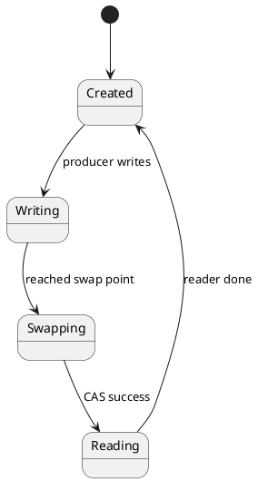
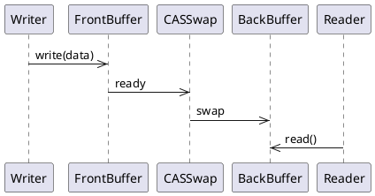

# Task 002: Tool Call Endpoint

**Status:** ✅ Complete
**Effort:** ~3 hours
**Priority:** Critical
**Dependencies:** Task 001

---

## Objective

Implement `POST /api/tools/{toolName}` endpoint to execute tools with parameters.

---

## Requirements

### Functional Requirements
1. Dynamic routing based on `{toolName}` path parameter
2. Implement `encodePlantUML` tool
3. Accept `plantumlCode` parameter in request body
4. Encode PlantUML code using standard algorithm
5. Return valid URL for plantuml.com
6. Handle unknown tools (404)
7. Handle wrong methods (405)

### Non-Functional Requirements
1. CORS headers enabled
2. Response time <500ms (cold start)
3. Deterministic encoding (same code → same URL)
4. Valid URLs that work on plantuml.com

### Request Format
```json
{
  "plantumlCode": "@startuml\nactor A\nactor B\nA --> B\n@enduml"
}
```

### Success Response Format
```json
{
  "success": true,
  "result": {
    "url": "https://www.plantuml.com/plantuml/svg/SoWkIImgAStDuNBAJrBGjLDmpCbCJbMmKiX8pSd9vt98pKi1IW80",
    "encoded": "SoWkIImgAStDuNBAJrBGjLDmpCbCJbMmKiX8pSd9vt98pKi1IW80",
    "format": "svg"
  }
}
```

### Error Response Format
```json
{
  "success": false,
  "error": {
    "code": "ERROR_CODE",
    "message": "Human-readable description"
  }
}
```

---

## Implementation Details

### File Structure
```
netlify/functions/tools-call.js
```

### Function Handler
```javascript
exports.handler = async (event, context) => {
  // Parse tool name from path
  // Dispatch to appropriate handler
  // Return response
};
```

### PlantUML Encoding Algorithm

#### Step 1: Compress
```javascript
const deflated = zlib.deflateRawSync(
  Buffer.from(plantumlCode, 'utf8'),
  { level: 9 }
);
```

#### Step 2: Base64 Encode
```javascript
const base64 = deflated.toString('base64');
```

#### Step 3: Character Mapping
```javascript
const PLANTUML_ALPHABET = '0123456789ABCDEFGHIJKLMNOPQRSTUVWXYZabcdefghijklmnopqrstuvwxyz-_';
const BASE64_ALPHABET = 'ABCDEFGHIJKLMNOPQRSTUVWXYZabcdefghijklmnopqrstuvwxyz0123456789+/';

let encoded = '';
for (let i = 0; i < base64.length; i++) {
  const char = base64[i];
  const index = BASE64_ALPHABET.indexOf(char);
  if (index !== -1) {
    encoded += PLANTUML_ALPHABET[index];
  }
}
```

#### Step 4: Construct URL
```javascript
const url = `https://www.plantuml.com/plantuml/svg/${encoded}`;
```

### Tool Dispatch
```javascript
switch (toolName) {
  case 'encodePlantUML':
    response = await handleEncodePlantUML(body.plantumlCode);
    break;
  default:
    response = {
      statusCode: 404,
      body: {
        success: false,
        error: {
          code: 'TOOL_NOT_FOUND',
          message: `Tool '${toolName}' not found`
        }
      };
}
```

---

## Testing Plan

### Manual Testing

#### Test 1: Valid Diagram Encoding
```bash
curl -X POST https://webodar.netlify.app/api/tools/encodePlantUML \
  -H "Content-Type: application/json" \
  -d '{
    "plantumlCode": "@startuml\nA --> B\n@enduml"
  }'
```

**Expected Result:**
- Status: 200 OK
- `success: true`
- `result.url` starts with `https://www.plantuml.com/plantuml/svg/`
- URL renders correct diagram

#### Test 2: FSM Diagram
```bash
curl -X POST https://webodar.netlify.app/api/tools/encodePlantUML \
  -H "Content-Type: application/json" \
  -d '{
    "plantumlCode": "@startuml\n[*] --> Writing\nWriting --> Swapping\n@enduml"
  }'
```

**Expected Result:**
- Status: 200 OK
- URL renders FSM diagram correctly

#### Test 3: Sequence Diagram
```bash
curl -X POST https://webodar.netlify.app/api/tools/encodePlantUML \
  -H "Content-Type: application/json" \
  -d '{
    "plantumlCode": "@startuml\nAlice -> Bob: Hello\n@enduml"
  }'
```

**Expected Result:**
- Status: 200 OK
- URL renders sequence diagram correctly

#### Test 4: Unknown Tool
```bash
curl -X POST https://webodar.netlify.app/api/tools/unknownTool \
  -H "Content-Type: application/json" \
  -d '{}'
```

**Expected Result:**
- Status: 404 Not Found
- `success: false`
- `error.code: "TOOL_NOT_FOUND"`

#### Test 5: Deterministic Encoding
```bash
# Encode same code twice, verify URLs are identical
curl -X POST https://webodar.netlify.app/api/tools/encodePlantUML \
  -H "Content-Type: application/json" \
  -d '{"plantumlCode": "@startuml\nA --> B\n@enduml"}' | jq -r '.result.url'
```

**Expected Result:**
- Both requests return same URL

---

## Acceptance Criteria

- [x] Endpoint accessible at `POST /api/tools/encodePlantUML`
- [x] Returns 200 OK on successful encoding
- [x] Returns `success: true`
- [x] Returns `result.url` with valid plantuml.com URL
- [x] Returns `result.encoded` with encoded string
- [x] Returns `result.format: "svg"`
- [x] URLs render correctly on plantuml.com
- [x] Same code → same URL (deterministic)
- [x] Unknown tools return 404
- [x] CORS headers present
- [x] Response is valid JSON
- [x] Response time <500ms

---

## Implementation Notes

### Character Mapping

The mapping is critical for PlantUML compatibility:

| Base64 | PlantUML | Base64 | PlantUML |
|--------|----------|--------|----------|
| A | 0 | a | 34 |
| B | 1 | b | 35 |
| ... | ... | ... | ... |
| + | - | / | _ |
| = | (ignored) | = | (ignored) |

### Validation
Validation is handled by `validatePlantUMLCode()` (see Task 003):
- Checks for empty/null code
- Checks size limit (50KB)
- Validates type

### Error Handling
All errors handled before encoding:
- Fail fast: Validate before expensive compression
- Clear error codes: EMPTY_CODE, CODE_TOO_LARGE, ENCODING_FAILED

---

## Dependencies

### External
- Node.js zlib (built-in)
- PlantUML.com (diagram rendering)

### Internal
- Task 003 (Error Handling) - for validation

---

## Risks & Mitigations

| Risk | Likelihood | Impact | Mitigation |
|------|------------|--------|------------|
| Encoding algorithm changes | Low | High | Pin algorithm version, validate URLs |
| PlantUML.com downtime | Medium | Medium | Document dependency, consider alternatives |
| Large diagrams | Low | Medium | 50KB limit, compress well |
| Non-deterministic encoding | Low | High | Test with known examples |

---

## Success Metrics

- Encoding success rate: >99%
- URL validity: 100% (all URLs work)
- Determinism: 100% (same code → same URL)
- Response time (p95): <500ms
- Integration success: Works with Claude/cto agents

---

## Known Issues

None

---

## Future Enhancements

### Phase 3
- Add more tools (Mermaid, validation)
- Add `format` parameter (svg, png, txt)
- Add template rendering
- Add diagram comparison

### Phase 4
- Add tool versioning
- Add tool metadata
- Add tool usage statistics
- Add batch encoding

---

## Examples

### Example 1: Lock-Free Buffer FSM


**URL:** `https://www.plantuml.com/plantuml/svg/...`

### Example 2: Writer-Reader Sequence


**URL:** `https://www.plantuml.com/plantuml/svg/...`

---

## References

- [SPEC.md - Tool Invocation](../SPEC.md#endpoint-2-tool-invocation)
- [ARCHITECTURE.md - Encoding Algorithm](../../../ARCHITECTURE.md#encoding-algorithm)
- [tests/examples.md](../tests/examples.md)

---

**Last Updated:** 2025-01-03
**Status:** Complete ✅
