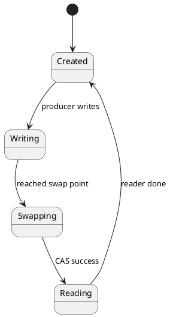
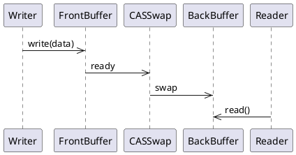

# Test Plan

## Overview

This document outlines the comprehensive testing strategy for the HTTP MCP-compatible PlantUML Encoder service.

## Testing Goals

1. Verify all endpoints work correctly
2. Validate error handling for all edge cases
3. Confirm response times meet performance targets
4. Test CORS and cross-origin requests
5. Validate deterministic encoding
6. Confirm URLs render correctly on plantuml.com

---

## Manual Testing Scenarios

### Scenario 1: Tool Discovery

**Objective:** Agents discover available tools and their schemas.

**Test Steps:**
```bash
curl -X GET https://webodar.netlify.app/api/tools \
  -H "Accept: application/json"
```

**Expected Results:**
- [ ] Status code: 200 OK
- [ ] Response contains `tools` array
- [ ] `encodePlantUML` tool is listed
- [ ] Tool has `id`, `name`, `description`, `inputSchema`
- [ ] `inputSchema` describes `plantumlCode` parameter
- [ ] `required` array contains `"plantumlCode"`
- [ ] Response time <500ms (cold start)
- [ ] Response time <100ms (warm start)

**Acceptance Criteria:**
- Agent can parse and understand tool schema
- Tool discovery works from any origin (CORS)

---

### Scenario 2: Valid Encoding

**Objective:** Agent encodes a valid PlantUML diagram.

**Test Steps:**
```bash
curl -X POST https://webodar.netlify.app/api/tools/encodePlantUML \
  -H "Content-Type: application/json" \
  -d '{
    "plantumlCode": "@startuml\nactor A\nactor B\nA --> B\n@enduml"
  }'
```

**Expected Results:**
- [ ] Status code: 200 OK
- [ ] `success: true`
- [ ] `result.url` starts with `https://www.plantuml.com/plantuml/svg/`
- [ ] `result.encoded` is non-empty string
- [ ] `result.format: "svg"`
- [ ] URL is valid and works in browser
- [ ] URL renders diagram correctly on plantuml.com
- [ ] Response time <500ms (cold start)
- [ ] Response time <100ms (warm start)

**Acceptance Criteria:**
- Agent can show URL to user
- User can view diagram by clicking URL
- Diagram renders correctly

---

### Scenario 3: Empty Code

**Objective:** Agent handles empty PlantUML code gracefully.

**Test Steps:**
```bash
curl -X POST https://webodar.netlify.app/api/tools/encodePlantUML \
  -H "Content-Type: application/json" \
  -d '{"plantumlCode": ""}'
```

**Expected Results:**
- [ ] Status code: 400 Bad Request
- [ ] `success: false`
- [ ] `error.code: "EMPTY_CODE"`
- [ ] `error.message: "plantumlCode is required and cannot be empty"`
- [ ] Error is descriptive for agents
- [ ] Agent can detect error and report to user

**Acceptance Criteria:**
- Error message is clear and actionable
- Agent can handle error and continue conversation

---

### Scenario 4: Oversized Code

**Objective:** Agent handles code exceeding 50KB limit.

**Test Steps:**
```bash
# Create 51KB file
dd if=/dev/zero bs=1024 count=51 | tr '\0' 'A' | tr -d '\n' > large.txt

curl -X POST https://webodar.netlify.app/api/tools/encodePlantUML \
  -H "Content-Type: application/json" \
  -d "{\"plantumlCode\":\"$(cat large.txt)\"}"
```

**Expected Results:**
- [ ] Status code: 413 Payload Too Large
- [ ] `success: false`
- [ ] `error.code: "CODE_TOO_LARGE"`
- [ ] `error.message: "PlantUML code exceeds maximum size of 50KB"`
- [ ] Error is descriptive
- [ ] Agent can explain error to user

**Acceptance Criteria:**
- Size limit enforced correctly
- Error message suggests solution (reduce size)

---

### Scenario 5: Multiple Sequential Calls

**Objective:** Service handles multiple sequential tool calls without issues.

**Test Steps:**
```bash
# Make 10 sequential calls
for i in {1..10}; do
  curl -X POST https://webodar.netlify.app/api/tools/encodePlantUML \
    -H "Content-Type: application/json" \
    -d '{"plantumlCode":"@startuml\nA --> B\n@enduml"}' \
    -w " %{time_total}s"
  echo
done
```

**Expected Results:**
- [ ] All 10 calls succeed
- [ ] Each call returns correct result
- [ ] No state persists between calls (stateless)
- [ ] Response time <100ms for warm calls
- [ ] Response time <500ms for cold calls
- [ ] All URLs work

**Acceptance Criteria:**
- Service scales for sequential requests
- No memory leaks or resource exhaustion
- Consistent performance

---

## Examples Verification

### Example 1: FSM for Lock-Free Buffer

**Input:**


**Test Command:**
```bash
curl -X POST https://webodar.netlify.app/api/tools/encodePlantUML \
  -H "Content-Type: application/json" \
  -d '{"plantumlCode":"@startuml\n[*] --> Created\n...\n@enduml"}'
```

**Verification:**
- [ ] Status: 200 OK
- [ ] URL returned
- [ ] URL renders FSM correctly
- [ ] All states visible (Created, Writing, Swapping, Reading)
- [ ] All transitions visible with labels

---

### Example 2: Writer-Reader Sequence

**Input:**


**Test Command:**
```bash
curl -X POST https://webodar.netlify.app/api/tools/encodePlantUML \
  -H "Content-Type: application/json" \
  -d '{"plantumlCode":"@startuml\nparticipant Writer\n...\n@enduml"}'
```

**Verification:**
- [ ] Status: 200 OK
- [ ] URL returned
- [ ] URL renders sequence diagram correctly
- [ ] All participants visible (Writer, FrontBuffer, etc.)
- [ ] All messages visible with labels

---

## Edge Cases

### Decision Table Testing

| Input | Type | Size | Expected Status | Expected Code |
|-------|------|------|-----------------|---------------|
| `""` | string | 0B | 400 | EMPTY_CODE |
| `null` | null | 0B | 400 | EMPTY_CODE |
| `"   \n\t  "` | string | 5B | 400 | EMPTY_CODE |
| `@startuml\n@enduml` | string | 20B | 200 | - |
| `"A".repeat(51200)` | string | 50KB | 200 | - |
| `"A".repeat(52224)` | string | 51KB | 413 | CODE_TOO_LARGE |
| Invalid UTF-8 | string | 10B | 500 | ENCODING_FAILED |

**Verification:** Test each row in table.

---

## Performance Testing

### Cold Start Test
```bash
# Wait 10 minutes for function to go cold
sleep 600

# Measure cold start time
curl -X POST https://webodar.netlify.app/api/tools/encodePlantUML \
  -H "Content-Type: application/json" \
  -d '{"plantumlCode":"@startuml\nA --> B\n@enduml"}' \
  -w "\nResponse Time: %{time_total}s\n"
```

**Targets:**
- [ ] Cold start <500ms
- [ ] P95 cold start <500ms
- [ ] P99 cold start <600ms

### Warm Start Test
```bash
# Make 100 warm requests
for i in {1..100}; do
  curl -X POST https://webodar.netlify.app/api/tools/encodePlantUML \
    -H "Content-Type: application/json" \
    -d '{"plantumlCode":"@startuml\nA --> B\n@enduml"}' \
    -w "%{time_total}s\n" >> times.txt
done

# Calculate statistics
awk '{sum+=$1; count++} END {print "Average:", sum/count; print "Min:", min; print "Max:", max}' times.txt
```

**Targets:**
- [ ] P50 <100ms
- [ ] P95 <200ms
- [ ] P99 <300ms
- [ ] No memory leaks (constant performance)

---

## CORS Testing

### Preflight (OPTIONS)
```bash
curl -X OPTIONS https://webodar.netlify.app/api/tools/encodePlantUML \
  -H "Origin: https://example.com" \
  -H "Access-Control-Request-Method: POST" \
  -v
```

**Verification:**
- [ ] Status: 200 OK
- [ ] `Access-Control-Allow-Origin: *`
- [ ] `Access-Control-Allow-Methods: POST, OPTIONS`
- [ ] `Access-Control-Allow-Headers: Content-Type`

### Cross-Origin POST
```bash
# Simulate cross-origin request
curl -X POST https://webodar.netlify.app/api/tools/encodePlantUML \
  -H "Origin: https://example.com" \
  -H "Content-Type: application/json" \
  -d '{"plantumlCode":"@startuml\nA --> B\n@enduml"}' \
  -v
```

**Verification:**
- [ ] Status: 200 OK
- [ ] CORS headers present
- [ ] Response is correct

---

## Integration Testing

### Claude Integration
1. Start a conversation with Claude
2. Ask Claude to generate a PlantUML diagram
3. Verify Claude can call the API
4. Verify URL is returned and displayed
5. Click URL to view diagram

**Verification:**
- [ ] Claude discovers tools via `/api/tools`
- [ ] Claude encodes diagram successfully
- [ ] Claude shows URL to user
- [ ] URL works and renders diagram

### cto Agent Integration
1. Trigger cto Planning Agent
2. Ask for architecture diagram
3. Verify agent encodes diagram
4. Verify URL is shared
5. Verify diagram renders correctly

**Verification:**
- [ ] Agent discovers tools
- [ ] Agent encodes diagram
- [ ] Agent provides URL to user
- [ ] User can view diagram

---

## Curl Commands Summary

```bash
# Test tool discovery
curl https://webodar.netlify.app/api/tools

# Test valid encoding
curl -X POST https://webodar.netlify.app/api/tools/encodePlantUML \
  -H "Content-Type: application/json" \
  -d '{"plantumlCode":"@startuml\nA --> B\n@enduml"}'

# Test empty code
curl -X POST https://webodar.netlify.app/api/tools/encodePlantUML \
  -H "Content-Type: application/json" \
  -d '{"plantumlCode":""}'

# Test null code
curl -X POST https://webodar.netlify.app/api/tools/encodePlantUML \
  -H "Content-Type: application/json" \
  -d '{"plantumlCode":null}'

# Test whitespace-only
curl -X POST https://webodar.netlify.app/api/tools/encodePlantUML \
  -H "Content-Type: application/json" \
  -d '{"plantumlCode":"   \n\n\t   "}'

# Test unknown tool
curl -X POST https://webodar.netlify.app/api/tools/unknownTool \
  -H "Content-Type: application/json" \
  -d '{}'

# Test wrong method
curl -X GET https://webodar.netlify.app/api/tools/encodePlantUML
```

---

## Success Criteria

### Functional
- [ ] All endpoints work correctly
- [ ] All error cases handled
- [ ] All validation rules enforced
- [ ] Deterministic encoding confirmed
- [ ] URLs render correctly

### Performance
- [ ] Cold start <500ms
- [ ] Warm start <100ms (p50)
- [ ] Warm start <200ms (p95)
- [ ] No memory leaks

### Integration
- [ ] CORS works from any origin
- [ ] Works with Claude
- [ ] Works with cto agent
- [ ] Works in browser
- [ ] Works from command line

---

## Known Issues

None

---

## References

- [scenarios.md](./scenarios.md) - Gherkin scenarios
- [examples.md](./examples.md) - Executable examples
- [edge-cases.md](./edge-cases.md) - Decision table

---

**Last Updated:** 2025-01-03
