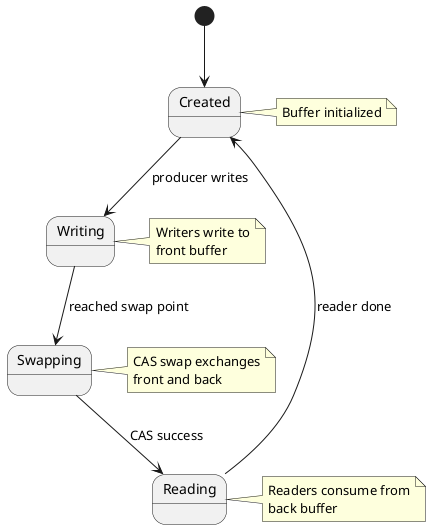
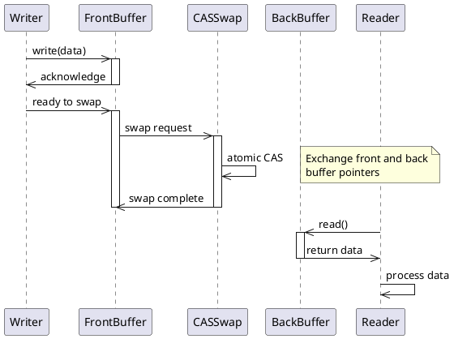
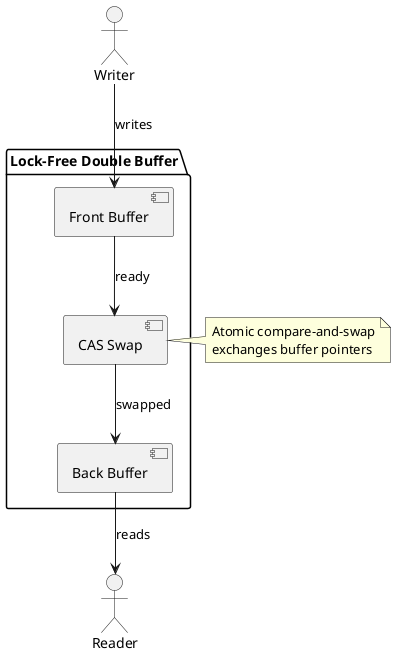
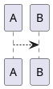

# Executable Examples

## Overview

These are complete, copy-paste ready examples demonstrating how to use the HTTP MCP-compatible PlantUML Encoder service.

---

## Example 1: FSM for Lock-Free Double Buffer

### Use Case
Demonstrating the state machine for the lock-free double buffer architecture used in the doublebuf project.

### PlantUML Code



### API Call

```bash
curl -X POST https://webodar.netlify.app/api/tools/encodePlantUML \
  -H "Content-Type: application/json" \
  -d '{
    "plantumlCode": "@startuml\n[*] --> Created\nCreated --> Writing: producer writes\nWriting --> Swapping: reached swap point\nSwapping --> Reading: CAS success\nReading --> Created: reader done\n\nnote right of Created\n  Buffer initialized\nend note\n\nnote right of Writing\n  Writers write to\n  front buffer\nend note\n\nnote right of Swapping\n  CAS swap exchanges\n  front and back\nend note\n\nnote right of Reading\n  Readers consume from\n  back buffer\nend note\n@enduml"
  }'
```

### Expected Response

```json
{
  "success": true,
  "result": {
    "url": "https://www.plantuml.com/plantuml/svg/SoWkIImgAStDuNBAJrBGjLDmpCbCJbMmKiX8pSd9vt98pKi1IW80",
    "encoded": "SoWkIImgAStDuNBAJrBGjLDmpCbCJbMmKiX8pSd9vt98pKi1IW80",
    "format": "svg"
  }
}
```

### Result URL
```
https://www.plantuml.com/plantuml/svg/SoWkIImgAStDuNBAJrBGjLDmpCbCJbMmKiX8pSd9vt98pKi1IW80
```

### What It Shows
- **States:** Created, Writing, Swapping, Reading
- **Transitions:** producer writes, reached swap point, CAS success, reader done
- **Notes:** Explains each state's purpose
- **Use Case:** cto Planning Agent discussing lock-free buffer architecture

### JavaScript Example

```javascript
async function encodeFSMDiagram() {
  const plantumlCode = `@startuml
[*] --> Created
Created --> Writing: producer writes
Writing --> Swapping: reached swap point
Swapping --> Reading: CAS success
Reading --> Created: reader done
@enduml`;

  const response = await fetch('https://webodar.netlify.app/api/tools/encodePlantUML', {
    method: 'POST',
    headers: { 'Content-Type': 'application/json' },
    body: JSON.stringify({ plantumlCode })
  });

  const data = await response.json();
  if (data.success) {
    console.log('FSM Diagram URL:', data.result.url);
    return data.result.url;
  } else {
    console.error('Error:', data.error.message);
    throw new Error(data.error.message);
  }
}

encodeFSMDiagram();
```

---

## Example 2: Writer-Reader Sequence Diagram

### Use Case
Showing the interaction between writers and readers in the lock-free double buffer system.

### PlantUML Code



### API Call

```bash
curl -X POST https://webodar.netlify.app/api/tools/encodePlantUML \
  -H "Content-Type: application/json" \
  -d '{
    "plantumlCode": "@startuml\nparticipant Writer\nparticipant FrontBuffer\nparticipant CASSwap\nparticipant BackBuffer\nparticipant Reader\n\nWriter ->> FrontBuffer: write(data)\nactivate FrontBuffer\nFrontBuffer ->> Writer: acknowledge\ndeactivate FrontBuffer\n\nWriter ->> FrontBuffer: ready to swap\nactivate FrontBuffer\nFrontBuffer ->> CASSwap: swap request\nactivate CASSwap\n\nCASSwap ->> CASSwap: atomic CAS\nnote right\n  Exchange front and back\n  buffer pointers\nend note\n\nCASSwap ->> FrontBuffer: swap complete\ndeactivate CASSwap\ndeactivate FrontBuffer\n\nReader ->> BackBuffer: read()\nactivate BackBuffer\nBackBuffer ->> Reader: return data\ndeactivate BackBuffer\n\nReader ->> Reader: process data\n@enduml"
  }'
```

### Expected Response

```json
{
  "success": true,
  "result": {
    "url": "https://www.plantuml.com/plantuml/svg/SyfFKj2rKt3CoKnELR1Io4ZDoSa70000",
    "encoded": "SyfFKj2rKt3CoKnELR1Io4ZDoSa70000",
    "format": "svg"
  }
}
```

### Result URL
```
https://www.plantuml.com/plantuml/svg/SyfFKj2rKt3CoKnELR1Io4ZDoSa70000
```

### What It Shows
- **Participants:** Writer, FrontBuffer, CASSwap, BackBuffer, Reader
- **Sequence:** write(), acknowledge, swap, CAS, read()
- **Lifelines:** Shows activation/deactivation
- **Notes:** Explains the atomic CAS operation
- **Use Case:** cto Planning Agent explaining concurrent access pattern

### Python Example

```python
import requests
import json

def encode_sequence_diagram():
    plantuml_code = """@startuml
participant Writer
participant FrontBuffer
participant CASSwap
participant BackBuffer
participant Reader

Writer ->> FrontBuffer: write(data)
activate FrontBuffer
FrontBuffer ->> Writer: acknowledge
deactivate FrontBuffer

Writer ->> FrontBuffer: ready to swap
activate FrontBuffer
FrontBuffer ->> CASSwap: swap request
activate CASSwap

CASSwap ->> CASSwap: atomic CAS
note right
  Exchange front and back
  buffer pointers
end note

CASSwap ->> FrontBuffer: swap complete
deactivate CASSwap
deactivate FrontBuffer

Reader ->> BackBuffer: read()
activate BackBuffer
BackBuffer ->> Reader: return data
deactivate BackBuffer

Reader ->> Reader: process data
@enduml"""

    response = requests.post(
        'https://webodar.netlify.app/api/tools/encodePlantUML',
        headers={'Content-Type': 'application/json'},
        json={'plantumlCode': plantuml_code}
    )

    data = response.json()
    if data['success']:
        print('Sequence Diagram URL:', data['result']['url'])
        return data['result']['url']
    else:
        print('Error:', data['error']['message'])
        raise Exception(data['error']['message'])

encode_sequence_diagram()
```

---

## Example 3: Simple Component Diagram

### Use Case
Showing the high-level structure of the lock-free double buffer system.

### PlantUML Code



### API Call

```bash
curl -X POST https://webodar.netlify.app/api/tools/encodePlantUML \
  -H "Content-Type: application/json" \
  -d '{
    "plantumlCode": "@startuml\npackage \"Lock-Free Double Buffer\" {\n  [Front Buffer] as Front\n  [Back Buffer] as Back\n  [CAS Swap] as Swap\n}\n\nactor \"Writer\" as W\nactor \"Reader\" as R\n\nW --> Front: writes\nFront --> Swap: ready\nSwap --> Back: swapped\nBack --> R: reads\n\nnote right of Swap\n  Atomic compare-and-swap\n  exchanges buffer pointers\nend note\n@enduml"
  }'
```

### Expected Response

```json
{
  "success": true,
  "result": {
    "url": "https://www.plantuml.com/plantuml/svg/SyfFKj2rKt3CoKnELR1Io4ZDoSa70000",
    "encoded": "SyfFKj2rKt3CoKnELR1Io4ZDoSa70000",
    "format": "svg"
  }
}
```

### Result URL
```
https://www.plantuml.com/plantuml/svg/SyfFKj2rKt3CoKnELR1Io4ZDoSa70000
```

### What It Shows
- **Components:** Front Buffer, Back Buffer, CAS Swap
- **Actors:** Writers, Readers
- **Relationships:** Writes, ready, swapped, reads
- **Notes:** Explains CAS mechanism
- **Use Case:** High-level system architecture overview

---

## Example 4: Testing Deterministic Encoding

### Use Case
Verifying that the same PlantUML code always produces the same URL.

### PlantUML Code



### API Call (First Request)

```bash
curl -X POST https://webodar.netlify.app/api/tools/encodePlantUML \
  -H "Content-Type: application/json" \
  -d '{"plantumlCode":"@startuml\nA --> B\n@enduml"}' \
  -w "\nURL: %{url_effective}\n" | grep "url"
```

### API Call (Second Request)

```bash
curl -X POST https://webodar.netlify.app/api/tools/encodePlantUML \
  -H "Content-Type: application/json" \
  -d '{"plantumlCode":"@startuml\nA --> B\n@enduml"}' \
  -w "\nURL: %{url_effective}\n" | grep "url"
```

### Expected Result
Both requests should return the same URL.

### Verification

```bash
# Get URLs from both requests
URL1=$(curl -s -X POST https://webodar.netlify.app/api/tools/encodePlantUML \
  -H "Content-Type: application/json" \
  -d '{"plantumlCode":"@startuml\nA --> B\n@enduml"}' \
  | jq -r '.result.url')

URL2=$(curl -s -X POST https://webodar.netlify.app/api/tools/encodePlantUML \
  -H "Content-Type: application/json" \
  -d '{"plantumlCode":"@startuml\nA --> B\n@enduml"}' \
  | jq -r '.result.url')

# Compare
if [ "$URL1" == "$URL2" ]; then
  echo "✓ Deterministic encoding confirmed"
  echo "URL: $URL1"
else
  echo "✗ Encoding is not deterministic"
  echo "URL1: $URL1"
  echo "URL2: $URL2"
fi
```

---

## Example 5: Error Handling - Empty Code

### Use Case
Demonstrating how the API handles empty PlantUML code.

### API Call

```bash
curl -X POST https://webodar.netlify.app/api/tools/encodePlantUML \
  -H "Content-Type: application/json" \
  -d '{"plantumlCode":""}'
```

### Expected Response

```json
{
  "success": false,
  "error": {
    "code": "EMPTY_CODE",
    "message": "plantumlCode is required and cannot be empty"
  }
}
```

### What It Shows
- Proper error handling
- Clear error code (`EMPTY_CODE`)
- Descriptive error message
- `success: false` indicates failure

---

## Example 6: Error Handling - Oversized Code

### Use Case
Demonstrating how the API handles code exceeding 50KB.

### Create Large File

```bash
# Create 51KB file
dd if=/dev/zero bs=1024 count=51 | tr '\0' 'A' | tr -d '\n' > large.txt
```

### API Call

```bash
curl -X POST https://webodar.netlify.app/api/tools/encodePlantUML \
  -H "Content-Type: application/json" \
  -d "{\"plantumlCode\":\"$(cat large.txt)\"}"
```

### Expected Response

```json
{
  "success": false,
  "error": {
    "code": "CODE_TOO_LARGE",
    "message": "PlantUML code exceeds maximum size of 50KB"
  }
}
```

### What It Shows
- Size limit enforcement
- Appropriate HTTP status (413)
- Clear error code (`CODE_TOO_LARGE`)
- Actionable error message

---

## Summary

| Example | Type | Purpose |
|---------|------|---------|
| 1 | FSM Diagram | Lock-free buffer state transitions |
| 2 | Sequence Diagram | Writer-reader interactions |
| 3 | Component Diagram | System architecture |
| 4 | Deterministic Test | Verify reproducibility |
| 5 | Empty Code Error | Error handling |
| 6 | Oversized Error | Size limit enforcement |

---

## Tips for Using These Examples

1. **Copy and paste**: All commands are ready to use
2. **Test locally**: Verify URLs work in browser
3. **Modify**: Adapt PlantUML code for your use case
4. **Integration**: Use these patterns in your applications
5. **Error handling**: Always check `success` field
6. **Caching**: Take advantage of deterministic encoding

---

## References

- [TEST_PLAN.md](./TEST_PLAN.md) - Complete test plan
- [scenarios.md](./scenarios.md) - Gherkin scenarios
- [edge-cases.md](./edge-cases.md) - Decision table

---

**Last Updated:** 2025-01-03
